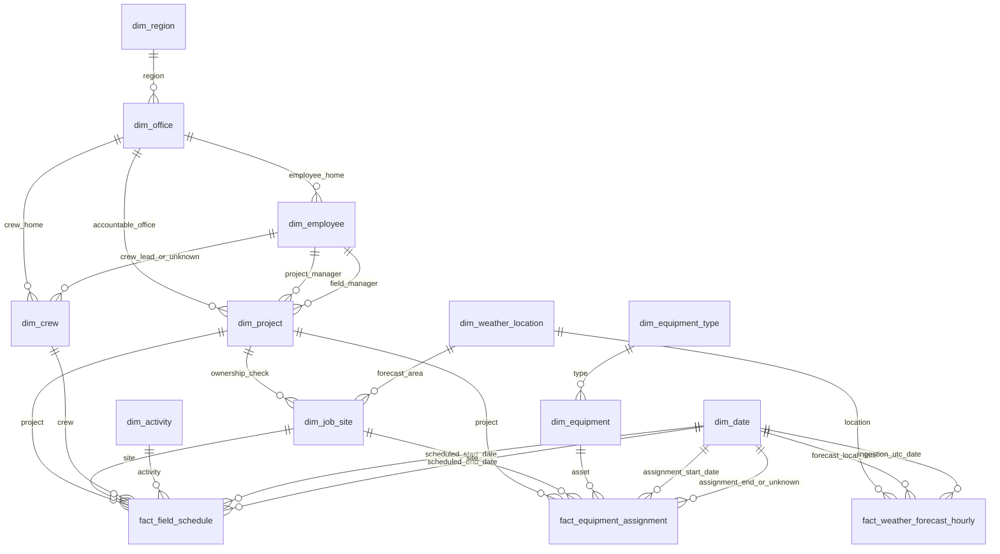

# Phase 11.2 — Dimensional Design

## 1. Purpose, scope, and status

**Phase 11.2: COMPLETE — logical dimensional design; implementation remains future work.** This document locks the three base-fact grains, eleven dimensions, key policy, mappings, and publication requirements for the existing `WH_FieldOps`. Completion does not certify deployed Gold objects or risk/dashboard readiness. The dependencies in section 19 have explicit later-phase owners and do not require guessing to define this base model.

Architecture remains Sources → Bronze Lakehouse → Silver Lakehouse → Fabric Warehouse → dbt Gold analytics layer → Semantic Model → Power BI. Python/PySpark retains ingestion and operational validation. Gold owns analytical typing, dimensions, key resolution, measures, reconciliation, tests, lineage, and documentation. Semantic models own presentation and explicit aggregation; the later risk engine owns temporal exposure and recommendations.

This is documentation only: no Fabric changes, Warehouse objects, SQL DDL, dbt models, source changes, notebooks, synthetic data changes, commits, or pushes. Phase 11.3 will verify/configure **existing `WH_FieldOps`**, not create another Warehouse.

## 2. Authoritative inputs and evidence limits

| Input | Authority and use |
| --- | --- |
| [Phase 11.1 verification](phase-11-1-silver-source-verification.md) | Completed owner-reported live verification; source objects, counts, column sets, lineage limits, and eight post-disposition orphans. No new live inspection is claimed here. |
| [Operational contracts](operational-data-contracts.md) and [schema reconciliation](silver-contract-schema-reconciliation.md) | Exact source columns, business/source keys, 19 relationships, optionality, warning preservation, dates, and decimal policy. |
| [Silver rule matrix](silver-validation-rule-mapping-matrix.md) and [completion record](silver-completion-status.md) | Implemented validation boundary; FSD-008 remains deferred. |
| [Operational ERD](operational-domain-erd.md) | Operational relationships only; not an existing Gold ERD. |
| [Dashboard coverage](dashboard-coverage-matrix.md), [risk specification](risk-engine-specification.md), [risk validation](risk-validation-matrix.md) | Seven intended pages and risk output categories; detailed scoring and metric coverage remain outlines. |
| [Synthetic plan](synthetic-data-generation-plan.md), [generator entities](../src/operational_data_generator/entities.py), [configuration](../src/operational_data_generator/config.py), [validators](../src/operational_data_generator/validators.py) | Deterministic row semantics, measures, scenarios, and relationship evidence. Scenario labels are fixtures, not measured risk. |
| [Bronze header contracts](../src/operational_bronze_ingestion/entity_config.py) | Required column names; not evidence of deployed SQL types. |
| [Weather configuration](../config/locations.yml), [API client](../src/weather_ingestion/api_client.py), [transformer](../src/weather_transformation/transformer.py), [Delta writer](../src/weather_transformation/delta_writer.py) | Location identity, payload metadata, nullable readings, and forecast-version merge grain. The older [weather contract](silver_weather_data_contract.md) is incomplete; use the verified Phase 11.1 column list and code. |
| [Forecast accuracy decision](forecast-accuracy-decision.md) | Observed-weather comparisons remain Version 2. Existing Silver code does preserve forecast runs; the older document's archive discussion does not override that implementation evidence. |
| [Negative acceptance plan](silver-negative-fabric-acceptance-plan.md) and [negative factory](../src/operational_negative_test_data/factory.py) | Historical negative scenario and reproducible quarantine effects. |

Verified operational sources are `LH_FieldOps` SQL endpoint `silver.<entity>` and Spark paths `Tables/silver/operations/<entity>`. Counts are regions 4, offices 12, employees 150, projects 75, job_sites 120, crews 40, activities 20, equipment_types 10, equipment 80, safety_thresholds 40, field_schedules 250, equipment_assignments 120: **921 rows across 12 entities**. Weather `dbo.silver_weather_forecast_hourly` has **4,032 rows**. Bronze `dbo.monitoring_operational_ingestion_runs` has **180 rows**.

These establish readability and column sets, not deployed data types/nullability, per-run weather counts, or the Bronze run behind current operational Silver. Operational code preserves strings. Missing current `Tables/validation/operational_results` and unverified contents of SQL `dbo.validation_negative` must not be interpreted as a clean-run ledger. The intermediate `silver.operations` sync warning did not invalidate the twelve verified entity tables.

## 3. Business processes and locked fact grain

Grain is decided before dimensions. Operational facts represent the selected accepted snapshot, not a sequence of ingestion snapshots. Replacing that snapshot replaces its analytical state coherently; repeated loads never append another copy of each occurrence. A publication identifier is technical lineage and does not enlarge the business grain. Historical snapshots, actual work, and utilization require separate future requirements.

| Business process / fact | Exactly one row represents | Uniqueness and version policy | Business use |
| --- | --- | --- | --- |
| Planned work / `fact_field_schedule` | One accepted `field_schedule_id` in the selected operational Silver snapshot | Unique `field_schedule_id`; roots and successors remain separate occurrences | Planned workload by project/site, crew, activity, and date; status and reschedule lineage |
| Asset placement / `fact_equipment_assignment` | One accepted `assignment_id` in that same operational snapshot | Unique `assignment_id`; an interval is not expanded to days/hours | Assignment counts and bounded assignment-hours by asset, type, site, and project |
| Forecast publication / `fact_weather_forecast_hourly` | One `pipeline_run_id` + `location_id` + `forecast_timestamp_local` | Composite unique key; retain every available run version | Version-specific weather context by location and forecast hour |

There is no base fact combining these processes. Shared site/project/location/date context supports comparison after independent aggregation; it does not establish which equipment or forecast applies to a schedule.

### Reporting coverage boundary

| Page | Base model contribution | Still requires later work |
| --- | --- | --- |
| Executive Overview | Planned occurrences and workload by project/office/region | Risk, tomorrow's business impact, leadership prioritization |
| Project Risk | Project/site/date context and manager roles | Exposure, score, continue/delay recommendation |
| Crew Scheduling | Crew/activity/date workload, status, predecessor IDs | Conflict resolution, reschedule advice, labor hours at risk |
| Safety | Weather values and retained rule input | Applicable-rule evaluation, overrides, notification policy; no contact fields exist |
| Equipment | Assignment counts/duration and asset/type context | Weather overlap, relocation advice, actual utilization |
| Regional Operations | Project office/region and separately named crew home-office roles | Regional risk rollups and prioritization |
| Pipeline Monitoring | Weather provenance; existing Bronze monitoring source | Separate monitoring model and verified run associations; 180 monitoring rows are not operational facts |

## 4. Key strategy and rationale

**Decision: persistent Warehouse integer surrogate keys (`BIGINT`) for the ten entity dimensions, and `YYYYMMDD` integer keys for `dim_date`. Do not adopt SHA-256 dimension keys.** Facts retain their source grain identifiers; no additional fact-row surrogate is needed for these base facts.

| Strategy | Advantages | Costs / decision |
| --- | --- | --- |
| Namespaced SHA-256 over a stable identifier | Reproducible independent builds; no allocation state | Wider joins/storage (32-byte digest or 64-character hex versus 8-byte integer), encoding/canonicalization contract, collision checks, and downstream key handling. Hashing source IDs also perpetuates any source-ID reuse. Not selected. |
| Persistent integer assignment | Compact relationship keys; identity distinct from source IDs/codes; stable Type 1 updates | Requires durable mapping and controlled insertion; numeric values need not match across independent environments. Selected. |
| Reuse source IDs or recompute row numbers | Simple first load | Couples warehouse identity to source or changes keys on rebuild; cannot support safe independent rebuilds. Rejected. |

Microsoft documents Warehouse `BIGINT IDENTITY`, including explicit sentinel insertion and reseeding. Native allocation is the recommended physical mechanism, subject to Phase 11.3 verification. dbt integration must preserve allocated mappings and must not infer that a model `unique_key` allocates keys or enforces uniqueness. No adapter version/materialization is selected here. See [Fabric identity support](https://learn.microsoft.com/en-us/fabric/data-warehouse/identity) and [dimensional loading guidance](https://learn.microsoft.com/en-us/fabric/data-warehouse/dimensional-modeling-load-tables).

Key resolution is two-stage: exact source FK → unique accepted parent source ID → persistent warehouse member key. For operational dimensions, persist both source ID and immutable business code/number. Allocate by the entity namespace and business identifier; enforce a one-to-one source-ID/business-key mapping in each snapshot and compare it with prior mappings. A changed pairing is an identity exception requiring review, not an automatic merge or a new member guessed from names. Source IDs are kept as lossless identifiers; do not trim, case-fold, remove leading zeros, or cast them to integers merely because fixtures use integers. Weather uses `location_id` as both source and business identity.

Use dimension-specific key names in section 8; the entity namespace is inherent in the dimension, not an invented Silver `source_system` field. Key registries and reserved-member definitions are Warehouse technical metadata, not source attributes. Retain mappings for absent members; do not recycle keys. Candidate dimensions contain current accepted members plus reserved members, while retained mappings do not make an absent/quarantined parent publishable.

Preserve existing mappings through retries, restores, and dbt full refreshes. Rebuilding a candidate dimension copies its assigned keys; it must not reallocate them. Serialize allocation per dimension and validate business-key uniqueness even when generated integer values are unique. Back up mappings with publication metadata. If identity cannot be used in the verified platform/toolchain, require a reviewed serialized persistent integer registry implementation; never silently fall back to hashes or `MAX + row_number` in concurrent dbt runs.

## 5. Detailed fact specification: field schedule

Source: `silver.field_schedules`. All source fields are accounted for below. Source names are retained unless an explicit derived target is listed.

| Source columns | Target / analytical transformation |
| --- | --- |
| `field_schedule_id` | Retain as unique grain key and degenerate schedule identifier. |
| `project_id`, `job_site_id`, `crew_id`, `activity_id` | Retain source identifiers; resolve `project_key`, `job_site_key`, `crew_key`, `activity_key` through accepted dimensions. |
| `scheduled_start_timestamp`, `scheduled_end_timestamp` | Retain parsed timestamps with their original local/unspecified-zone semantics; no UTC conversion. |
| `scheduled_date` | Retain typed date; derive `scheduled_date_key` as YYYYMMDD. It is also the scheduled-start date role because FSD-002 requires equality. |
| `scheduled_end_timestamp` | Additionally derive `scheduled_end_date_key` from its calendar date. End date may differ from start date. |
| `planned_crew_hours`, `planned_labor_hours` | Preserve supplied planned measures as decimals; do not replace crew hours with interval duration when FSD-003 produced a warning. |
| `planned_crew_size` | Preserve integer planned persons for this occurrence; no crew-dimension size exists. |
| `status` | Retain exact categorical value on the fact; no status dimension needed. |
| `rescheduled_from_schedule_id` | Retain nullable degenerate predecessor identifier; verify against accepted schedules without joining successor rows into the base fact. |
| `scenario_id` | Retain nullable synthetic scenario metadata, hidden from ordinary business measures. It is not a risk result or a cross-fact join key. |
| No source column (Gold derivation) | `schedule_occurrence_count = 1`. |

Required direct FKs: four entity keys and both date roles. No project-start/end keys on this fact: project dates describe the project, not the schedule event. No employee, office, region, or weather-location copies on the fact; section 10 defines their many-to-one paths.

All statuses contribute to the unfiltered baseline. Completed records still contain **planned**, not actual, hours. Rescheduled roots and successors both count. Their combined hours describe recorded plan occurrences, not deduplicated demand or remaining work. Semantic measures must name their status filters; no implicit latest-successor rule is introduced. A predecessor may have multiple successors; lineage traversal is a separate query and never a base-grain expansion.

## 6. Detailed fact specification: equipment assignment

Source: `silver.equipment_assignments`.

| Source columns | Target / analytical transformation |
| --- | --- |
| `assignment_id` | Unique grain key and degenerate assignment identifier. |
| `equipment_id`, `job_site_id`, `project_id` | Retain source identifiers; resolve `equipment_key`, `job_site_key`, `project_key`. |
| `assignment_start_timestamp` | Retain parsed timestamp; derive `assignment_start_date_key` from calendar date. |
| `assignment_end_timestamp` | Retain nullable parsed timestamp; derive `assignment_end_date_key`, or unknown date key when open-ended. |
| `assignment_note`, `scenario_id` | Retain nullable note and synthetic scenario metadata. Neither establishes actual usage. |
| Both timestamps (Gold derivation) | `bounded_assignment_hours = (end - start)` in hours only for a valid bounded interval with comparable time semantics. Otherwise open end yields NULL; malformed/nonpositive bounded intervals block publication. |
| No source column (Gold derivation) | `assignment_occurrence_count = 1`. |

Required direct FKs: equipment, site, project, and start date. End date always references a real or reserved date member. This is assigned interval duration, **not actual equipment utilization**, runtime, productive hours, or equipment-hours at risk. The current naive timestamp subtraction measures source wall-clock hours; physical elapsed duration across time-zone/DST changes is not established. Do not substitute the publication time for an open end.

## 7. Detailed fact specification: hourly weather forecast

Source: `dbo.silver_weather_forecast_hourly`.

| Source columns | Target / analytical transformation |
| --- | --- |
| `pipeline_run_id`, `location_id`, `forecast_timestamp_local` | Retain the complete composite grain key. Run ID is a degenerate version identifier, not a date or sortable sequence. |
| `location_id` | Additionally resolve `weather_location_key`. |
| `forecast_timestamp_local` | Additionally derive `forecast_date_key` from local calendar date; keep full timestamp for hourly analysis. |
| `ingestion_timestamp_utc` | Retain UTC timestamp; derive `ingestion_date_key` using its UTC calendar date. It is ingestion time, not forecast issue time. |
| `temperature_2m`, `apparent_temperature`, `relative_humidity_2m`, `precipitation`, `wind_gusts_10m` | Retain nullable numeric forecast readings; do not replace NULL with zero. |
| `weather_code` | Retain nullable categorical weather code; not a summable measure. |
| `temperature_unit`, `apparent_temperature_unit`, `relative_humidity_unit`, `precipitation_unit`, `weather_code_unit`, `wind_gust_unit` | Retain each metric's source unit on the versioned fact; no implicit conversion. |
| `source_system`, `endpoint_name`, `location_name` | Retain source provenance and run-recorded location label. |
| `latitude`, `longitude`, `elevation`, `timezone`, `timezone_abbreviation`, `utc_offset_seconds` | Retain run-recorded payload context. These are not job-site coordinates; timezone abbreviation/offset are not timeless location attributes. |
| `forecast_hour_index`, `forecast_days`, `attempt_count`, `http_status_code` | Retain ordinal/request/ingestion metadata. Index is array position, not forecast lead time; repeated metadata must not be summed as request counts. |

No source columns are dropped and no issue timestamp, observed weather, confidence score, or heat-index measure is invented. There is no base forecast occurrence measure for business workload; technical row count is permitted for reconciliation and must state whether it counts versions.

The Silver writer merges on exactly the three-column grain and updates matching rows. Gold must be idempotent at that grain, preserve distinct runs, and reconcile same-key corrections; it cannot promise immutable revisions within the same run because the source does not provide them. Missing historical versions in a subsequent extraction must not silently delete already retained forecast runs. An approved retention/correction policy is required before pruning history. Repeated local timestamps within the same run/location (including a potential DST ambiguity) fail uniqueness; do not silently add `forecast_hour_index` to change the verified grain.

There is no latest-row collapse or applicable-forecast choice. Multi-run visuals require an explicit run selection/comparison. Neither ingestion time nor lexicographic run ID establishes a final forecast-applicability policy.

## 8. Dimension matrix and complete attribute mappings

Decision: retain nine operational entity dimensions, add the conformed weather location and calendar dimensions; exclude `dim_safety_threshold`. This is a fact constellation with deliberate dimension-to-dimension relationships. Separate office/region, employee, and equipment-type dimensions support shared roles and rule context. They are not additional facts and contain no additive measures.

For every row below: one business entity per row, no historical versions; retain all listed source fields with exact names. The surrogate key is Gold-generated. Relationship keys are additional Gold derivations from the listed source FKs. Dates are typed; optional text remains nullable under section 14. Baseline counts exclude reserved members.

| Dimension / business purpose | Source / grain / baseline | Source ID → business key → surrogate | Descriptive source attributes | Derived relationships | SCD |
| --- | --- | --- | --- | --- | --- |
| `dim_region`: regional accountability | `silver.regions`; one region; 4 | `region_id` → `region_code` → `region_key` | `region_name`, `region_description` | None | 1 |
| `dim_office`: operating office | `silver.offices`; one office; 12 | `office_id` → `office_code` → `office_key` | `office_name`, `office_description`; retain `region_id` | `region_key` from `region_id` | 1 |
| `dim_employee`: people in accountable roles | `silver.employees`; one employee; 150 | `employee_id` → `employee_number` → `employee_key` | `employee_name`, `employment_status`, `termination_date`, `employee_role_code`; retain `home_office_id` | `home_office_key` from `home_office_id` | 1 |
| `dim_project`: project context/ownership | `silver.projects`; one project; 75 | `project_id` → `project_code` → `project_key` | `project_name`, `status`, `project_start_date`, `project_end_date`, `priority_code`, `project_description`, `parent_project_code`; retain `office_id`, `project_manager_employee_id`, `field_manager_employee_id` | `office_key`, `project_manager_employee_key`, `field_manager_employee_key` from respective source IDs | 1 |
| `dim_job_site`: work location context | `silver.job_sites`; one site; 120 | `job_site_id` → `job_site_code` → `job_site_key` | `job_site_name`, `weather_location_code`, `job_site_description`; retain `project_id` | `project_key` from `project_id`; `weather_location_key` from exact weather-code mapping | 1 |
| `dim_crew`: scheduled crew identity | `silver.crews`; one crew; 40 | `crew_id` → `crew_code` → `crew_key` | `crew_status`, `crew_description`; retain `home_office_id`, `crew_lead_employee_id` | `home_office_key`; `crew_lead_employee_key` (unknown if absent) | 1 |
| `dim_activity`: kind of planned work | `silver.activities`; one activity; 20 | `activity_id` → `activity_code` → `activity_key` | `activity_name`, `activity_description`, `activity_category` | None | 1 |
| `dim_equipment_type`: asset classification | `silver.equipment_types`; one type; 10 | `equipment_type_id` → `equipment_type_code` → `equipment_type_key` | `equipment_type_name`, `equipment_type_description`, `equipment_category` | None | 1 |
| `dim_equipment`: assigned asset | `silver.equipment`; one asset; 80 | `equipment_id` → `equipment_code` → `equipment_key` | `equipment_status`, `serial_number`, `asset_tag`, `equipment_description`; retain `equipment_type_id` | `equipment_type_key` from `equipment_type_id` | 1 |
| `dim_weather_location`: shared forecast area | Versioned repository `config/locations.yml`, reconciled to Silver weather and job sites; one configured `location_id`; 3 | `location_id` → `location_id` → `weather_location_key` | `location_name`; `latitude` → `requested_latitude`; `longitude` → `requested_longitude`; `timezone` → `requested_timezone`; `active` → `is_configured_active` | None; actual response coordinates/offsets remain on weather fact | 1 |
| `dim_date`: calendar grouping in named roles | Gold-generated calendar; one calendar date | calendar date → `calendar_date` → `date_key` (YYYYMMDD) | Derived `calendar_year`, `calendar_quarter`, `calendar_month`, `day_of_month`, `iso_weekday` (Monday=1), `iso_week`, `iso_week_year`, `is_weekend` | None | 0 |

This matrix is the detailed dimension source-to-target contract, not an illustrative subset. No `crew_name`, nominal `crew_size`, employee contact information, site latitude/longitude, or equipment utilization attributes are available. Missing warning-only labels do not change entity identity or cause a fabricated name to replace the source value.

### SCD and lifecycle policy

Type 1 updates overwrite current accepted attributes while keeping surrogate keys stable, including relationship changes. Existing fact analysis consequently uses current project managers, crew leads, office/region associations, and labels. There is no supported as-was ownership history. Snapshot replacement and lack of immutable source changes do not justify Type 2. Threshold effective dates are rule validity, not evidence of historical dimension versions.

Forecast measurement/version metadata stays on the fact so Type 1 changes to a location label/configuration cannot rewrite the run-recorded payload. Location membership is configured; inactive locations remain if referenced by retained weather runs. Do not discard a location on `active=false`. Removal from configuration while retained facts refer to it requires preserving the prior member/configuration evidence or blocking publication.

Date attributes are Type 0 and deterministic; adding newly needed dates does not change existing dates. No fiscal, holiday, shift, or regional calendar is inferred. Reserved members are static in every dimension.

## 9. Weather location reconciliation

The mapping exists as an **explicit shared code domain**, not a separate crosswalk table. The operational generator's `WEATHER_LOCATIONS` and JBS-004/XEN-007 use the same three codes as `config/locations.yml.location_id`. `generate_job_sites` assigns those codes; the weather client propagates configured IDs/names and the transformer preserves them in Silver.

| `job_sites.weather_location_code` | Weather/config `location_id` | Configured `location_name` |
| --- | --- | --- |
| `TX-DAL` | `TX-DAL` | Dallas |
| `TX-HOU` | `TX-HOU` | Houston |
| `TX-AUS` | `TX-AUS` | Austin |

Join by exact code equality, never by city name, coordinates, office name, or geographic proximity. Many sites share a forecast area; a site is not an independent weather station. The configuration is a documented supplemental reference input captured by revision in each candidate publication, not another operational Silver entity. Use its stable requested coordinates/timezone as dimension attributes; preserve weather response coordinates/elevation on the fact because API response context need not equal request coordinates.

Future publication must verify every site code and weather location resolves to one configured member, and report missing forecast coverage separately from missing identity. A configured location with no forecast can exist, but absence of required risk-window coverage must later produce unavailable risk input, not safe weather. The 4,032-row live summary does not establish the actual distinct location set, name consistency, or temporal coverage; validate those on extraction. Additional codes require an explicit configuration/contract change. Do not infer mappings from names.

## 10. Fact/dimension relationships and role playing

Each key lookup below is many-to-one from child to parent, backed by candidate uniqueness checks. These are logical Warehouse relationships, not instructions to activate every path in Power BI.

| Child | FK → parent key | Role / cardinality reason |
| --- | --- | --- |
| `fact_field_schedule` | `project_key` → `dim_project.project_key`; `job_site_key` → `dim_job_site.job_site_key`; `crew_key` → `dim_crew.crew_key`; `activity_key` → `dim_activity.activity_key` | One owner project, site, crew, and activity per occurrence |
| `fact_field_schedule` | `scheduled_date_key`, `scheduled_end_date_key` → `dim_date.date_key` | Start/business scheduled date and end date |
| `fact_equipment_assignment` | `equipment_key` → `dim_equipment.equipment_key`; `job_site_key` → `dim_job_site.job_site_key`; `project_key` → `dim_project.project_key` | One assigned asset, site, and project per interval |
| `fact_equipment_assignment` | `assignment_start_date_key`, `assignment_end_date_key` → `dim_date.date_key` | Interval boundaries, not a daily allocation |
| `fact_weather_forecast_hourly` | `weather_location_key` → `dim_weather_location.weather_location_key`; `forecast_date_key`, `ingestion_date_key` → `dim_date.date_key` | Forecast area, local target date, UTC ingestion date |
| `dim_office` | `region_key` → `dim_region.region_key` | Office's source-defined region |
| `dim_employee`, `dim_crew` | Each `home_office_key` → `dim_office.office_key` | Separate employee and crew home-office roles |
| `dim_project` | `office_key` → `dim_office.office_key` | Accountable project office; default regional workload path |
| `dim_project` | `project_manager_employee_key`, `field_manager_employee_key` → `dim_employee.employee_key` | Two roles of the same employee dimension |
| `dim_crew` | `crew_lead_employee_key` → `dim_employee.employee_key` | Optional crew lead; no member roster or employee-to-schedule allocation exists |
| `dim_job_site` | `project_key` → `dim_project.project_key`; `weather_location_key` → `dim_weather_location.weather_location_key` | Site ownership consistency and conformed forecast-area identity |
| `dim_equipment` | `equipment_type_key` → `dim_equipment_type.equipment_type_key` | Each asset has one type |

No duplicate physical employee dimensions. Role views/semantic aliases distinguish project manager, field manager, and crew lead; employee role code does not prove eligibility or actual labor participation. Project-manager home region is not project region. Use project → office → region for default regional workload; use explicitly named roles for crew/employee home geography.

Both operational facts have direct project and site keys because both occur in the source; require fact project = site project. The site-to-project path is for integrity/navigation and must not create a second active project filter path. Similarly, employee/home-office and crew/home-office roles require isolated semantic paths. Default single-direction filters flow from dimensions toward facts; no automatic bidirectional paths or fact-to-fact relationships. Use scheduled/start/forecast date as each fact's default date role; alternate dates require explicit role views or measures. Semantic implementation must verify path ambiguity and totals.

For cross-process comparisons, aggregate each fact to the same explicitly chosen conformed grain before aligning results. Sharing a date or site never authorizes a raw join: schedules, assignments, and weather versions can each have multiple matching rows. Counts, hours, and weather readings would fan out.

### Parent projects

Retain nullable `parent_project_code` **as an attribute only**. The generated baseline is empty and the reconciled contract explicitly does not define this as an FK. No `parent_project_key`, recursive rollup, inferred parent, or hierarchy bridge is designed. If hierarchy becomes a requirement, define parent existence, cycles, effective dating, and rollup behavior before adding it.

## 11. Date/time strategy

Use one physical `dim_date`, played in six named fact roles: scheduled/start, scheduled end, assignment start, assignment end, forecast target, and ingestion. There is no redundant `scheduled_start_date_key`: `scheduled_date_key` covers that role after verifying FSD-002. Project start/end and employee termination remain typed dimensional attributes; they do not create extra schedule dates or date-dimension FKs in this release.

Generate a continuous calendar from January 1 of the earliest referenced year to December 31 of the latest referenced year across candidate operational dates (including optional project/termination/rule dates), retained forecast target dates, and weather ingestion UTC dates. Extend the existing calendar; never shrink it or use today's date to shift a deterministic fixture. Rule dates influence coverage without publishing a rule fact. All present dates must resolve; overflow or invalid dates block the candidate rather than map to unknown.

Preserve source timestamp precision and local/UTC distinctions. Operational timestamps lack an established time-zone contract; weather has local timestamps and run metadata. Do not assign operational times `America/Chicago` merely because configured forecast locations use it. Retain full hourly timestamps; no time-of-day dimension is needed now. Forecast UTC conversion, DST disambiguation, operational/weather interval matching, and physical elapsed time are later explicit temporal-policy work.

## 12. Measures and aggregation behavior

| Measure/attribute | Definition | Aggregation behavior and limits |
| --- | --- | --- |
| `schedule_occurrence_count` | 1 per schedule row | Additive across disjoint rows in one snapshot, including statuses and date-role partitions. Not across successive snapshots or duplicated joins; not distinct crews or unique work orders. |
| `planned_crew_hours` | Source planned duration for the crew's occurrence | Additive planned crew-hours across disjoint occurrences; does not remove overlap/conflicts or predecessor/successor duplication of business intent. |
| `planned_labor_hours` | Source crew-hours × source planned crew size | Additive planned person-hours under the same conditions. Validate decimal equality with absolute tolerance 0.000001. No actual labor inference. |
| `planned_crew_size` | Planned persons for this occurrence | Non-additive headcount. Do not sum as distinct workforce. Explicit per-occurrence average/min/max is valid; a labor/crew-hour ratio is a separately named weighted size. |
| `assignment_occurrence_count` | 1 per assignment row | Additive across disjoint assignments; not distinct assets, concurrent assets, or active inventory. |
| `bounded_assignment_hours` | Valid bounded end minus start in source wall-clock hours | Additive over bounded disjoint assignment records and their dimension/date-role partitions. Not a daily utilization allocation; start-date grouping attributes the entire interval to its start. Show bounded/open counts with sums; all-open groups remain NULL. |
| `temperature_2m`, `apparent_temperature`, `relative_humidity_2m`, `wind_gusts_10m` | Nullable forecast readings with corresponding units | Non-additive. Explicit min/max or suitably labelled average at compatible units and chosen run/location/hour scope; never sum. Apparent temperature is not automatically heat index. |
| `precipitation` | Nullable source hourly forecast amount | Conditionally semi-additive: sum nonoverlapping hourly amounts within one location, one run, and one unit only after confirming source interval/amount semantics. Never sum across locations or runs. Until confirmed, publish hourly values without a total; missing hours make interval totals incomplete. |
| `weather_code`, statuses, IDs, scenario codes | Categorical values | Non-additive; counts/grouping only. |
| `forecast_hour_index`, `forecast_days`, `attempt_count`, `http_status_code`, coordinates/offsets | Ordinal and request/context attributes | Non-additive metadata. Repetition at hourly grain does not represent independent requests or quantities. |

There are no balance/inventory snapshot measures. Selecting two date roles does not duplicate facts; expanding an interval across dates does. Any future daily/hourly allocation requires a separately declared grain and reconciliation to the original total. Ratios, percentages, distinct assets/crews, and risk-adjusted measures belong to explicit semantic or later derived models, not summable base columns.

## 13. Safety thresholds: retain a rule entity outside the core stars

**Decision: retain accepted `silver.safety_thresholds` as a governed rule input outside the eleven dimensions and three base facts.** A threshold row expresses a predicate/action with applicability and validity, not a descriptive member attached once to each schedule. Multiple rules can apply to one occurrence; making it a dimension FK or joining it into a base fact would either lose rules or multiply rows. A fact-like numeric threshold table would misleadingly invite summation. A rule/exposure bridge can be designed with the later risk-result grain, not now.

Source-to-future-rule-input disposition (no new table created):

| Source fields | Retained semantics / later responsibility |
| --- | --- |
| `threshold_id` | Unique rule identifier, preserved; no current dimensional surrogate |
| `activity_id`, `equipment_type_id` | Required activity and optional equipment-type scope; validate against accepted parents. Missing type is the contract's unscoped rule category, not an unknown equipment asset. |
| `metric_code`, `comparison_operator`, `unit` | Rule predicate metadata; complete registry and conversions remain unresolved |
| `threshold_value_or_code_set`, `threshold_value`, `weather_code_set` | Preserve all representations; numeric payload versus categorical set per SFT-003/004/005. No sum or silent coercion between them. |
| `severity`, `recommended_action_code` | Rule severity/action labels; not calculated schedule risk |
| `effective_start_date`, `effective_end_date` | Source validity dates; NULL end remains open-ended; future engine determines applicability to exposure time |
| `is_active`, `override_flag` | Source rule flags; override precedence and combined-rule outcome require engine policy |

Reconcile all **40** baseline rules even though they are outside the star row counts. Preserve their selected-snapshot provenance for later evaluation; Type 1 dimensions do not substitute for versioned risk-rule audit evidence. The generated `HEAT_INDEX_F` cannot simply be mapped to `apparent_temperature` or `temperature_2m`; the metric definition/source is unresolved. Raw weather units and threshold units must be explicitly reconciled before evaluation.

## 14. Unknown/default members and nulls

Every entity dimension has exactly one reserved unknown member with key **-1** and one not-applicable member with key **-2**. `dim_date` uses the same two reserved integer values outside its YYYYMMDD domain; their `calendar_date` and calendar attributes are NULL. Reserved entity rows have NULL source/business identifiers, display labels `Unknown` / `Not applicable` where a label exists, and no invented business data. Uniqueness tests on source/business IDs exclude reserved rows. Reserve the values explicitly; never depend on identity allocation order. All reserved dimension-to-dimension keys point to the corresponding reserved parent member.

| Condition | Required behavior |
| --- | --- |
| Missing required source ID, business key, entity FK, or date | Block candidate publication. Never rescue it with a default member. |
| Populated FK whose accepted parent is absent/quarantined | Block candidate even if a prior published dimension or durable registry contains that ID. |
| Absent optional crew lead | `crew_lead_employee_key = -1`; preserve NULL source ID and warning eligibility. Unknown lead, not fabricated employee. |
| Open assignment end | `assignment_end_date_key = -1`, timestamp and duration NULL. Open/unknown future end is not zero duration or a fake far-future date. |
| Missing warning-only descriptive label or equipment status | Keep the real member's key, preserve missing value; semantic display may label it missing. Do not turn the whole entity into Unknown. |
| Missing predecessor / parent project / termination or project date / note / scenario | Keep NULL attribute with its contextual meaning (e.g. predecessor absent means lineage root); no invented FK. |
| Missing weather reading | NULL; report completeness before aggregates; zero remains a distinct observed forecast value. |
| Not applicable | Key -2 is reserved for explicitly approved future roles; no current base fact requires it. Do not use it for failed lookups. |

Gold may convert exact empty optional values to NULL for typed analytical storage, while preserving original source values in the candidate extraction/audit evidence. Only NULL and exact empty string are missing, consistent with Silver. Whitespace-only values are not trimmed or silently treated as empty. Malformed populated dates/numbers or lossy conversions fail candidate validation. Logical target types are lossless identifier/text, integer counts, decimal planned measures/duration, boolean flags, and date/timestamp types; physical sizes/precision and deployed type compatibility are Phase 11.3/11.5 checks. Do not round away validation differences.

## 15. Publication and referential-integrity design

**Fail the entire invalid candidate analytical batch and preserve the previously published good state, including its Type 1 dimensions.** No row-dropping workaround or unknown-key substitution for quarantined parents is permitted. This is required because Silver validates relationships against incoming data before final disposition.

Fabric primary/foreign/unique constraints are documented as not enforced; pipeline/dbt checks must enforce the design independently. Constraint declarations alone are insufficient. See [Fabric Warehouse constraint behavior](https://learn.microsoft.com/en-us/fabric/data-warehouse/table-constraints).

Required future publication sequence:

1. Capture a consistent, replayable accepted operational snapshot across all twelve entities, a defined weather extraction/version set, and the location-configuration revision. Record candidate ID, source object names, extraction time, per-entity versions or checksums, counts, and transformation/key-policy version. These are new technical metadata requirements, not fields asserted to exist in Silver. If coherent capture cannot be established, do not publish.
2. Freeze the candidate inputs. Preserve original values for conversion/lineage reconciliation. Record operational Bronze/Silver run attribution only when proven; the 180-row monitoring source cannot supply that association by assumption. Missing findings are not evidence of zero findings.
3. Build isolated candidate dimensions/facts and retain rule-input evidence. Reuse persistent keys; allocate new ones under concurrency control. Never update visible Type 1 dimension rows before candidate approval. Allocation gaps after failed candidates are acceptable; mappings must not expose failed business rows.
4. Validate uniqueness, lossless typing, all **19** contract FKs against the **accepted candidate parents**, required/conditional null rules, project/site equality, schedule lineage, and additional Gold/weather/date relationships. Preserve Silver warning semantics; Gold checks analytical publication integrity, not a second implementation of the full Silver rule engine.
5. Reconcile entity source counts, projected dimension counts, fact-grain counts, joins that preserve row counts, measure totals, null counts, weather versions, and source-to-target differences. Retain a durable success/failure record even when no row-level findings exist.
6. Promote the whole validated model coherently. A supported transaction or a validated version-switch mechanism must ensure consumers see one complete publication, never mixed old/new dimensions and facts. Bind semantic refresh to that publication. Phase 11.3/11.4 must select and prove the physical mechanism; no transactional capability is assumed from this document.
7. On any validation/promotion failure, leave the published state and consumer reference unchanged, retain diagnostic evidence, and permit an idempotent retry. Prove rollback/recovery with failure injection before production publication. Serialize conflicting publication attempts and prevent input changes after checks.

The selected operational snapshot replaces the current operational facts as a unit, including legitimate removals. Weather is reconciled by version grain with prior retained runs; that is separate from operational snapshot replacement. Calendar/location coverage must include retained weather history. Before model exposure, every nonreserved FK must resolve exactly once inside the published candidate, regardless of a source key's existence in historical registries.

### Mandatory negative case

| Quarantined parent | Accepted child references still present after disposition | Expected orphan relationships |
| --- | --- | ---: |
| Job Site `1` | Schedules `1`, `117`, `137`, `156`, `192`, `242` | 6 |
| Job Site `1` | Assignments `15`, `96` | 2 |
| **Total** | Count actual missing site-parent relationships, not duplicate rule messages | **8** |

The candidate must fail with these exact eight orphan relationships; old Job Site `1` in a previous good publication must not make it pass. The published good model, row counts, totals, key mappings for existing members, and consumer publication identity remain unchanged. This documents Phase 11.4/11.7 controls; it does not implement or rerun Fabric acceptance.

## 16. Dimensional ERD

The Mermaid diagram shows logical many-to-one relationships. The relationship matrix is authoritative for column names, optionality, and semantic activation. Rule input stays outside the core ERD; no base-fact-to-base-fact edges exist.

## 17. Risk-engine boundary

Later risk design must explicitly establish schedule/assignment interval overlap, forecast as-of selection and ties, time zones/DST, missing/stale weather policy, weather-hour weighting, equipment applicability, rule metric/unit registry, effective-date boundaries, rule precedence and overrides, risk-result grain, explanation, recommendation, and model/rule version lineage. No such results exist on these base facts.

Conformed dimensions make these inputs interpretable; they do not solve temporal applicability. Do not join weather to schedules solely on date/location and do not join assignments to schedules solely on site/project. A later exposure model must declare its many-to-many allocation/aggregation policy and prove no inflation of planned hours. Retain scenario IDs for fixture traceability only. Neither scenario names nor forecast weather codes certify expected risk outcomes without the missing engine specification.

## 18. Deterministic future acceptance criteria

These are implementation acceptance requirements, not claims that Gold tests already ran.

| ID | Required evidence / pass condition |
| --- | --- |
| D01 | Twelve clean operational inputs match 921 rows and the Phase 11.1 per-entity counts for the designated baseline. Nine operational dimensions contain 511 real members in total; thresholds remain 40 separate rules. Counts exclude two reserved rows per dimension. |
| D02 | Schedule unique count = row count = sum of occurrence count = **250**; planned crew-hours = **2,000**; planned labor-hours = **10,912**. Status counts: **197 Scheduled, 44 Completed, 9 Rescheduled**. No row duplicated by key resolution. |
| D03 | Assignment unique count = row count = sum of occurrence count = **120**; baseline bounded duration = **1,200 hours**. A separate open-end fixture produces NULL end/duration, unknown end date, and unchanged occurrence count; never zero duration. |
| D04 | Every source column in the mappings exists in the verified contract; derived fields use only declared expressions/lookups. No actual-work, cancellation-reason, adjustment, nominal crew-size, or unverified issue-time fields. |
| D05 | Each real dimension source ID and business identifier is unique, paired consistently, and maps to exactly one integer key. Reserved keys exist once each. Attribute-only Type 1 changes and repeat builds retain keys; no source/business-key reuse is silently accepted. |
| D06 | All required and populated optional source relationships resolve against accepted candidate parents. Gold keys resolve exactly once; fact/site project equality holds. Date coverage is complete and continuous; scheduled_date equals start calendar date. |
| D07 | Negative candidate reports precisely six schedule-site and two assignment-site orphans listed in section 15, refuses publication, and leaves the prior good publication intact. Verify this even when the old dimension contains Job Site 1. |
| D08 | For the exact Phase 11.1 weather extraction, target count = **4,032** and composite grain is unique; reconcile counts per run and location from extracted evidence, not an assumed run count. Subsequent loads use their recorded input counts rather than hard-coding 4,032. |
| D09 | Two runs forecasting the same location/hour survive as two rows; replaying either run adds no duplicate. Same-grain corrections follow Silver values with recorded reconciliation; no silent removal of prior runs. Duplicate same-run/local-hour keys fail. |
| D10 | Configured mapping produces three real weather-location members for this baseline; every site/weather ID resolves by exact code. Config/response coordinate differences remain distinguishable. Missing readings remain NULL; source units persist. |
| D11 | Join each fact to its allowed dimension paths and confirm unchanged grain count and measures. Test role paths separately, including both project-manager roles, crew lead, home offices, and alternate dates. No semantic ambiguity or base-fact join inflates totals. |
| D12 | Retain all 40 rule inputs and every listed payload/effective-date field; validate accepted parent references without attaching rule rows to base facts. No risk score or heat-index equivalence inferred. |
| D13 | Test warning-only missing labels, optional lead absence, lineage root, open assignment, unknown weather reading, malformed typed values, and unresolved populated FK separately. Defaults must never conceal an integrity failure. |
| D14 | Candidate freeze, concurrent allocation/publication protection, durable success/failure ledger, promotion failure, retry, and restore prove all-or-nothing visibility, unchanged prior good state on failure, and stable existing keys. |
| D15 | Source snapshot manifest identifies operational capture evidence, weather versions, configuration revision, transformation version, and unresolved/unavailable run attribution honestly. Counts from Bronze monitoring are not substituted for Silver lineage. |

The baseline generator can be evaluated in memory to reconcile these design constants without rewriting synthetic files. Physical Warehouse/dbt/semantic tests belong to later phases; passing the existing Python suite only establishes repository regression safety for this documentation change.

## 19. Explicit dependencies and completion decision

| Dependency | Evidence / required resolution | Owner and blocking boundary |
| --- | --- | --- |
| Existing Warehouse configuration and toolchain | Verify permissions, SQL types/collation, integer identity/sentinel support, dbt adapter/materialization behavior, stable-key preservation, and publication mechanism | Phase 11.3 then 11.5; blocks physical implementation choices, not logical design completion |
| Consistent operational capture and lineage | Current source-to-run attribution is unproven; select a replayable multi-entity snapshot and explicit manifest | Phase 11.4; blocks publication until proven |
| Durable validation/publication evidence | Current operational findings location absent; establish an always-written candidate outcome ledger without treating absent findings as success | Phase 11.4/11.7; blocks publication acceptance |
| Runtime source types and weather distribution | Live column sets/counts do not prove types, nullability, distinct locations, run counts, uniqueness, or calendar coverage | Phase 11.3/11.4; verify rather than infer before typed loading |
| Temporal and metric policy | No operational timezone, final applicable-forecast policy, precipitation interval confirmation, complete safety registry, or heat-index source/definition | Later risk design; blocks risk/exposure and unverified weather totals, not preservation of base facts |
| Historical rules and forecast retention | Rule snapshot audit and forecast same-key correction/retention behavior need operational policies; no observed-weather input | Later risk/history design; no forecast-accuracy claim or silent history pruning |
| Reporting details | Dashboard/risk documents remain outlines; finalize measures, status filters, role views, and filter paths | Semantic/reporting and risk phases; blocks claims of complete dashboard delivery |
| Broader source contracts | Employee/crew/equipment status domains, hierarchy semantics, adjustment mechanism, immutable FSD-008 history remain unresolved | Future source/business design; preserve current accepted values and do not expand this phase |

No unresolved dependency prevents the **base dimensional design** from being complete: facts, dimensions, mappings, aggregation limits, and failure behavior are explicit without inventing inputs. These dependencies do prevent describing the platform as implemented or ready to publish risk analytics. Reopen this design if later verified evidence contradicts a locked grain, identity, or relationship; do not quietly change it during implementation.

**Single recommended next action: Phase 11.3 — verify/configure the existing `WH_FieldOps` Warehouse.** Phase 11.3 is not performed here.

## 20. Documentation and repository validation record

Validation performed on 2026-09-24:

- A read-only documentation audit passed **35 checks**: UTF-8/conflict markers, balanced fences, 24 local links, 17 Markdown tables, all 104 operational source columns across 12 entities, all 29 weather columns, baseline totals/statuses, configured weather identity, the six schedule and two assignment orphans, ERD structure/entity count, and 15 future acceptance criteria. The generator and existing Silver engine were evaluated in memory; no synthetic files were written. Mermaid validation covered relationship structure, not a rendered diagram.
- Existing regression suite: `uv --cache-dir .uv-cache run --isolated --python 3.12 --extra dev python -m pytest -q` — **129 passed in 7.12s**, no failures or skips reported. The stale local virtual environments referenced an unavailable interpreter; the working supported Python 3.12 environment was used after approved environment access.
- `git diff --check` passed. Only this design document and README are intended repository changes. No tests, implementation code, dependencies, notebooks, or data were changed. No Fabric execution, commit, or push was performed.

These results validate the documentation and repository regression baseline; D01–D15 remain future Warehouse/dbt acceptance requirements.
